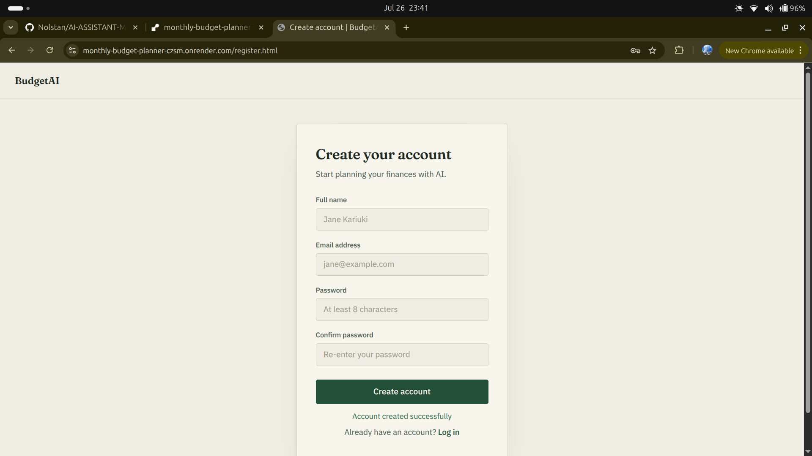
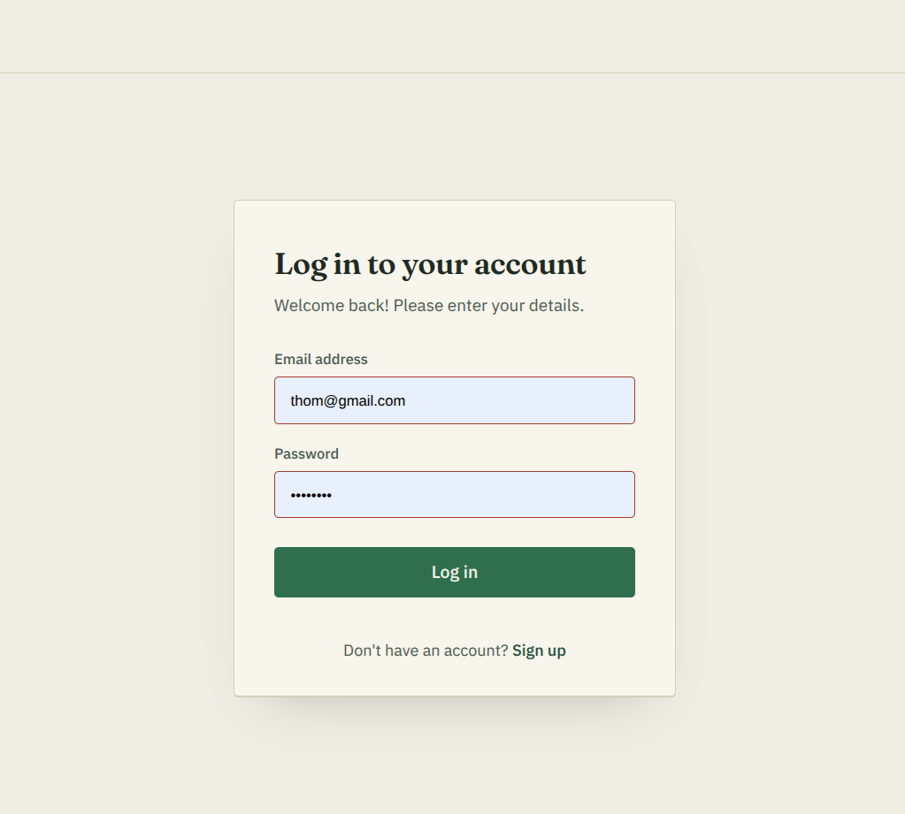
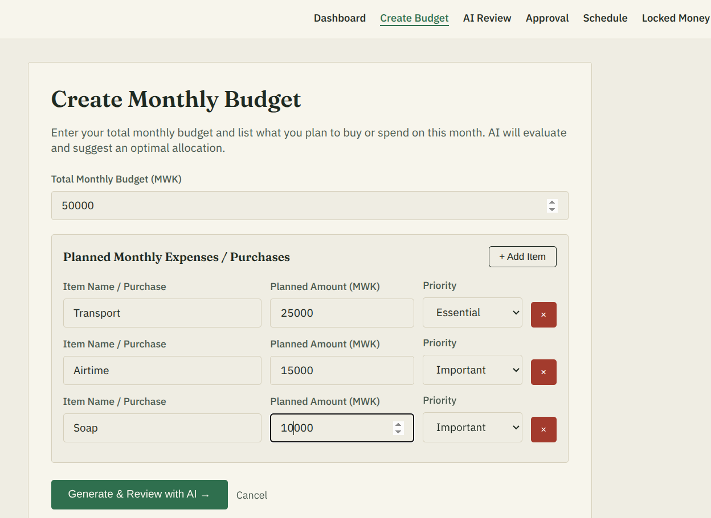
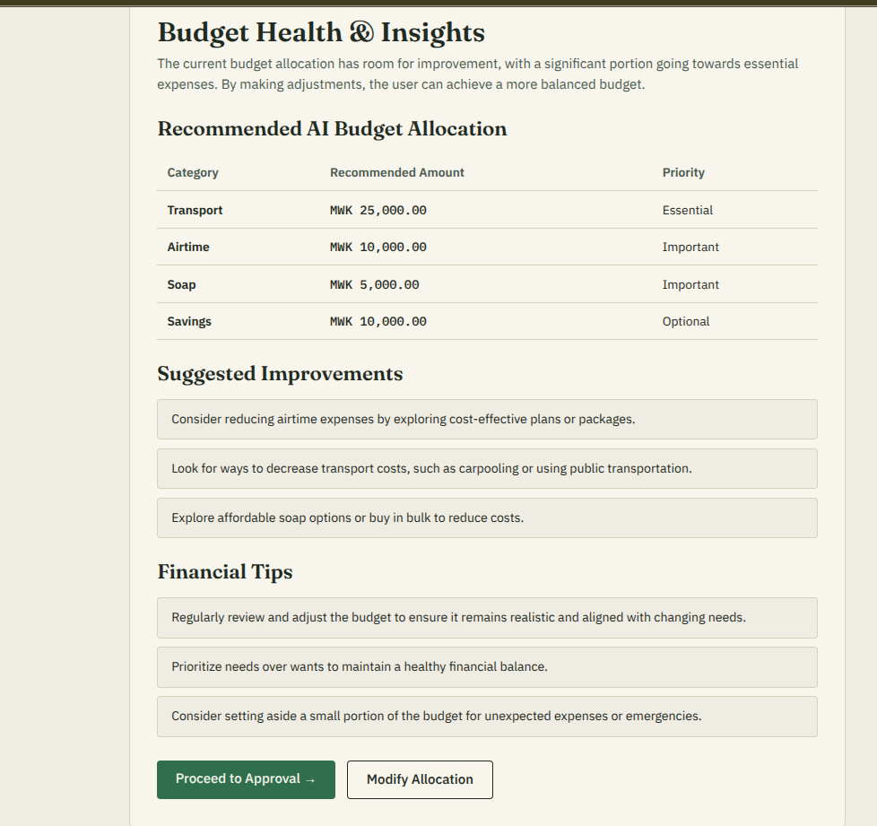
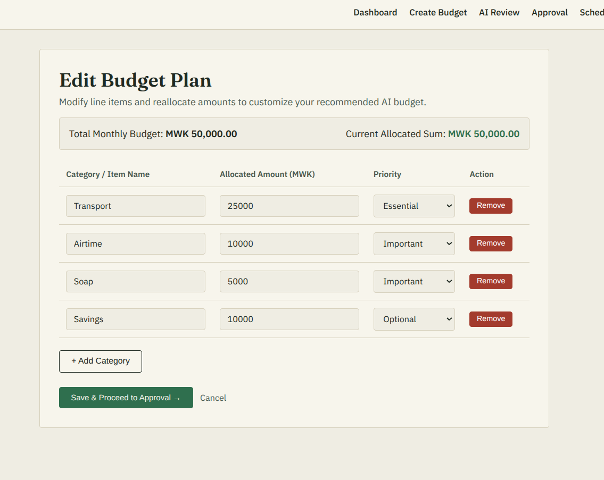
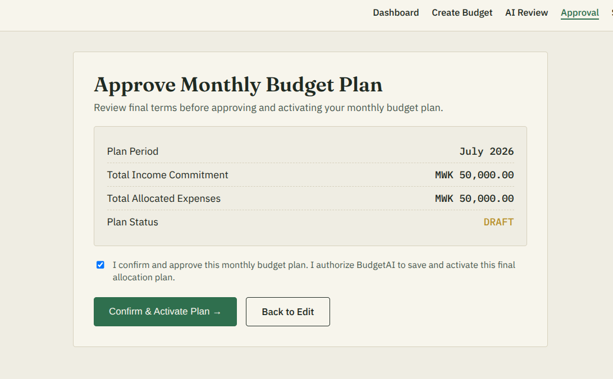
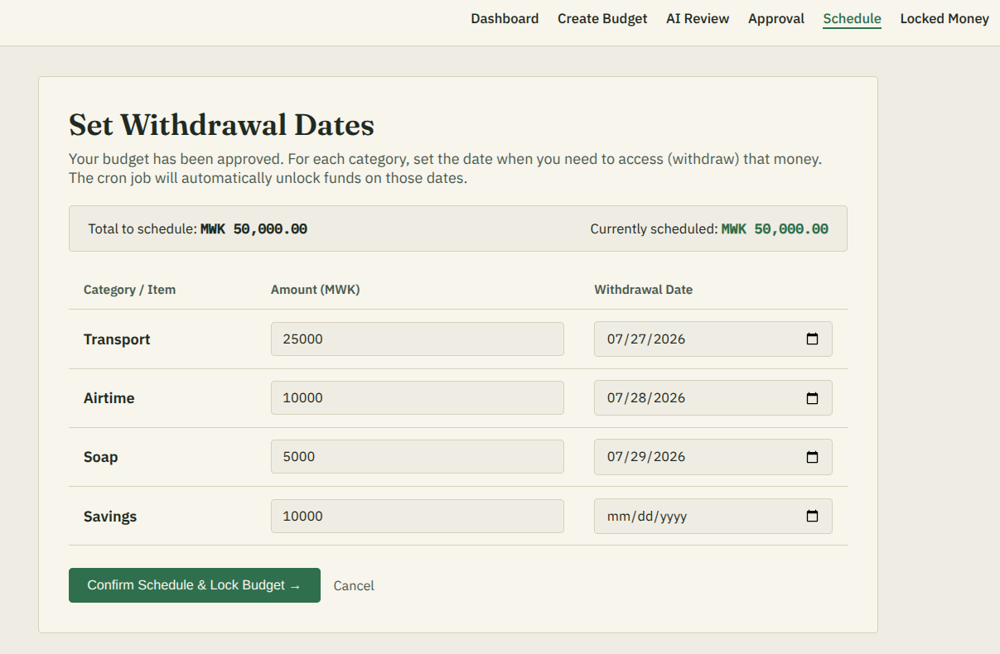
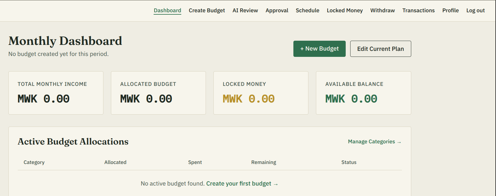
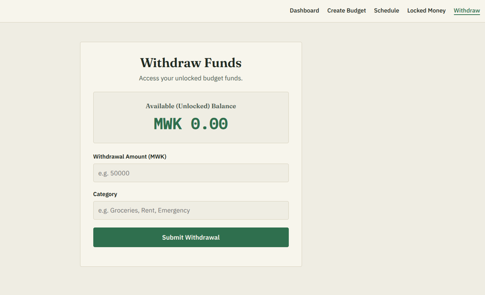

# BudgetAI - Smart Budget Planner & Locker

BudgetAI is a web application designed to help users take control of their personal finances through intelligent budget planning and automated time-locked savings. Instead of just tracking expenses, this app forces financial discipline by physically "locking" allocated funds until user-defined withdrawal dates.

---

## Problem Statement

Managing personal finances is a challenge for many individuals because existing budgeting applications primarily monitor spending instead of preventing poor financial decisions. Users often create budgets with good intentions but end up spending money allocated for essential expenses such as rent, groceries, transport, bills, or savings before those expenses are due. This leads to overspending, missed financial goals, increased debt, and financial stress.

Another challenge is creating a realistic monthly budget. Many people struggle to balance their income with their expenses and are unsure how much they should allocate to each spending category.

---

## Proposed Solution

BudgetAI combines Artificial Intelligence with automated financial discipline to help users spend according to plan.

Users begin by entering their monthly income and planned expenses. The integrated AI analyzes the proposed budget and generates a balanced recommendation that ensures income is allocated realistically across different categories.

Once the user approves the AI-generated budget, each budget category is assigned a withdrawal date. The allocated funds are then locked by the system and remain inaccessible until their scheduled release date. An automated background scheduler releases funds only when they become available, helping users avoid impulsive spending while ensuring money is available when it is actually needed.

By combining intelligent budgeting with controlled access to funds, BudgetAI helps users develop better financial habits, reduce unnecessary spending, and consistently achieve their financial goals.

---

## Key Features

- **AI Budget Optimization** – Submit a rough monthly budget and let AI generate a balanced spending plan.
- **Time-Locked Vaults** – Allocate funds to budget categories and lock them until user-defined withdrawal dates.
- **Multiple Budget Plans** – Manage multiple monthly budgets independently.
- **Transaction Auditing** – Complete ledger of deposits, withdrawals, and locked funds.
- **Dashboard Overview** – Monitor total allocated, locked, and available balances from a single dashboard.
- **Secure Authentication** – User accounts protected using JWT authentication and password hashing.

---

## Tech Stack

### Frontend
- HTML5
- CSS3 (Vanilla)
- JavaScript

### Backend
- Node.js
- Express.js

### Database
- MongoDB
- Mongoose

### AI Integration
- Groq API

### Background Processing
- node-cron

### Authentication
- JWT
- bcryptjs

---

## Prerequisites

Before running the project, ensure you have:

- Node.js (v18 or later)
- MongoDB (Local or MongoDB Atlas)
- A Groq API Key

---

# Installation & Setup

## 1. Clone the Repository

```bash
git clone https://github.com/Nolstan/AI-ASSISTANT-MONTHLY-BUDGET-PLANNER.git

cd AI-ASSISTANT-MONTHLY-BUDGET-PLANNER
```

---

## 2. Install Backend Dependencies

Navigate into the server folder.

```bash
cd server

npm install
```

---

## 3. Configure Environment Variables

Create a `.env` file inside the `server` directory.

```env
PORT=5000

MONGO_URI=your_mongodb_connection_string

JWT_SECRET=your_jwt_secret

GROQ_API_KEY=your_groq_api_key
```

---

## 4. Start the Backend

```bash
npm run dev
```

The backend will start at:

```
http://localhost:5000
```

A background cron job automatically checks every midnight for funds whose release dates have arrived.

---

## 5. Run the Frontend

The frontend consists of static HTML, CSS, and JavaScript files.

Navigate to the client folder:

```bash
cd ../client
```

Serve it using Live Server or Python:

```bash
python3 -m http.server 3000
```

Open:

```
http://localhost:3000
```

---

# Project Workflow

## Step 1 — Register Account

New users create an account by providing their personal details. The system securely stores their information and encrypts their password before creating the account.

**Screenshot: Registration Page**



---

## Step 2 — Login

Registered users authenticate using their email and password. Upon successful login, they are redirected to their personal dashboard.

**Screenshot: Login Page**



---

## Step 3 — Create Budget

The user enters:

- Monthly income
- Expected expenses

**Screenshot: Create Budget**



---

## Step 4 — AI Budget Review

The backend sends the budget to the Groq AI model, which analyzes the submitted information and returns a balanced spending plan with personalized recommendations.

**Screenshot: AI Recommendation**



---

## Step 5 — User Approval

The user reviews the AI recommendations, makes any necessary adjustments, and approves the final budget.

**Screenshot: Budget Modification and Approval**




---

## Step 6 — Schedule & Lock Funds

The user assigns withdrawal dates to each budget category. The system then locks the allocated funds until their scheduled release dates.

**Screenshot: Schedule & Lock Funds**



---

## Step 7 — Dashboard Overview

The dashboard provides an overview of the user's financial status, including total allocated funds, locked balances, available balances, and recent transactions.

**Screenshot: Dashboard**



---

## Step 8 — Automatic Fund Release

A scheduled background task automatically releases locked funds when their withdrawal dates arrive. Released funds become available for withdrawal, and every transaction is recorded for accountability.


**Screenshot: Released Funds**
Funds that are unlocked will be withdrawn here


# Why BudgetAI?

Unlike traditional budgeting applications that only monitor spending, BudgetAI actively helps users stick to their financial plans by preventing early access to allocated funds.

The combination of AI-powered budget planning and time-locked budgeting encourages financial discipline rather than simply tracking spending after it has already occurred.

---

# Future Improvements

- Mobile application (React Native)
- Mobile Money integration
- Bank integration
- SMS and email reminders
- Spending analytics and visual reports
- Savings goal tracking
- AI-powered financial insights
- Investment recommendations

---

# Team PIRATES

| Name | Role |
|------|------|
| Laston Kumwenda | Programmer |
| Pauline Malonda | Designer |
| Tom Gwetsa | Coordinator |
| Saidat Uwiycheza | Designer |
| Ulunji Ndalahoma | Researcher |

---

# Demo

https://drive.google.com/drive/folders/1ZOptLgchKx66BO8FT2qOyRnLzE-7FX5b

---

